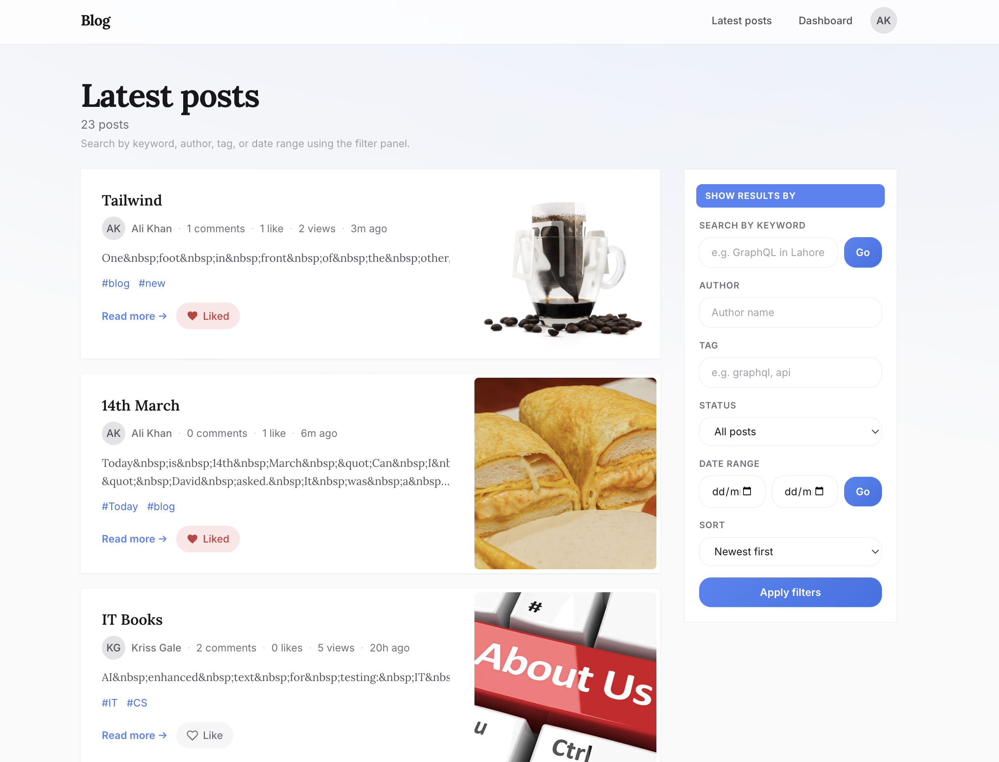
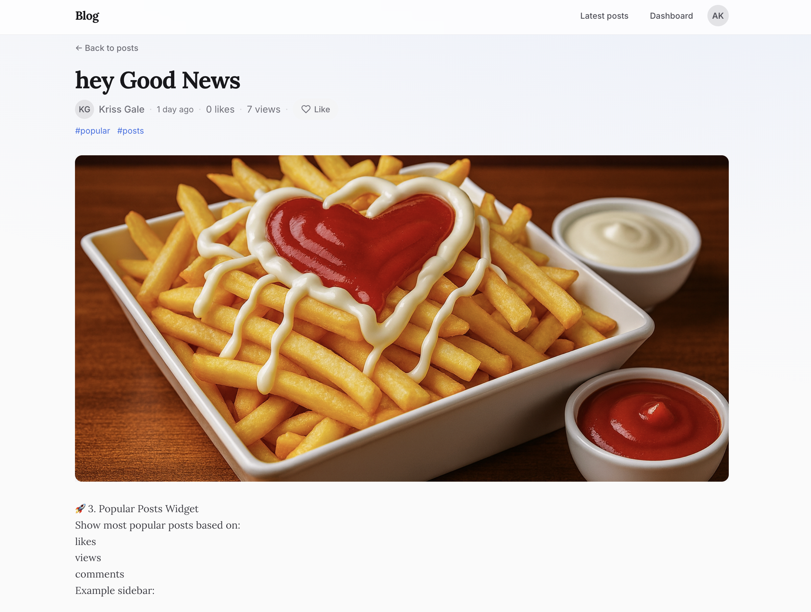
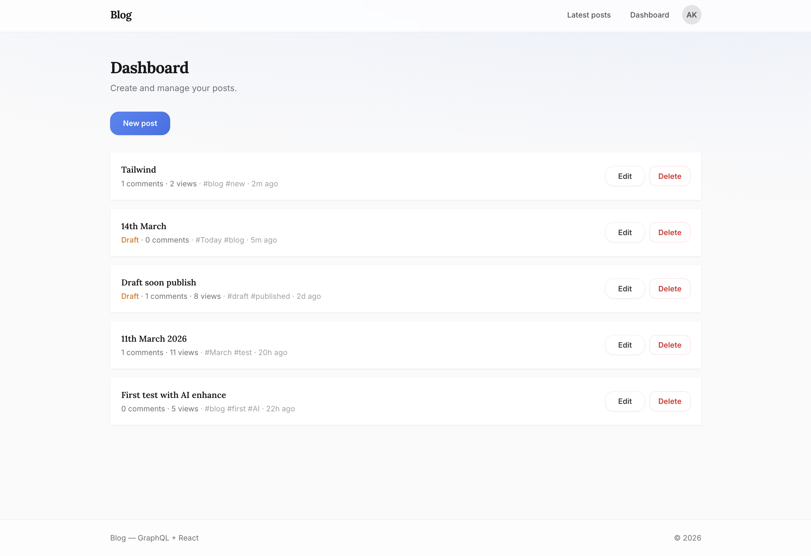
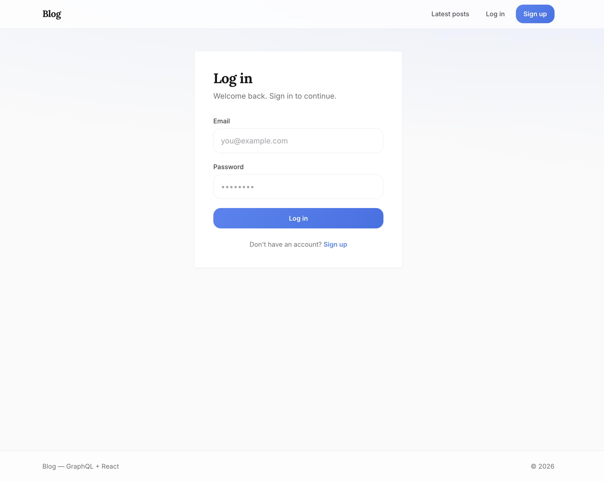

# GraphQL Blog

Full-stack blog app: **React (Vite)** frontend and **Node.js (GraphQL)** backend. Users can register, publish posts with cover images, comment, like, and use an optional AI writing assistant in the editor.

## Tech stack

| Layer     | Tech |
|----------|------|
| Frontend | React 18, Vite, React Router, Apollo Client, Tailwind CSS, react-quill-new |
| Backend  | Node.js, Express, Apollo Server (GraphQL), MongoDB (Mongoose) |
| Auth     | JWT (Bearer), bcrypt |
| Uploads  | graphql-upload, apollo-upload-client |

## Prerequisites

- **Node.js** (v16+)
- **MongoDB** at `mongodb://127.0.0.1:27017/blogDB`

## Quick start

### 1. Backend (server)

```bash
cd server
npm install
cp .env.example .env   # then set JWT_SECRET and optionally OPENAI_API_KEY
npm start
```

- API: http://localhost:5005  
- GraphQL: http://localhost:5005/graphql  
- Uploads: http://localhost:5005/uploads  

### 2. Frontend (client)

```bash
cd client
npm install
npm run dev
```

- App: http://localhost:3000  

The client proxies `/graphql` and `/uploads` to the server, so both must run for the app to work.

## Screenshots

Add your own screenshots to the `screenshots/` folder, then they will appear below. Suggested names: `home.png`, `post.png`, `dashboard.png`, `login.png`.

| Home | Post page |
|------|-----------|
|  |  |

| Dashboard | Login |
|-----------|-------|
|  |  |

## Project structure

```
graphql-blog-api/
├── screenshots/            # App screenshots for README (home.png, post.png, etc.)
├── client/                 # React frontend
│   ├── src/
│   │   ├── components/
│   │   ├── context/
│   │   ├── graphql/
│   │   ├── lib/
│   │   ├── pages/
│   │   ├── App.jsx
│   │   └── main.jsx
│   ├── index.html
│   ├── package.json
│   └── vite.config.js
├── server/                  # GraphQL API
│   ├── config/
│   ├── models/
│   ├── schema/
│   ├── index.js
│   ├── .env.example
│   └── package.json
├── .gitignore
└── README.md
```

## Server environment

In `server/.env` (copy from `server/.env.example`):

| Variable         | Required | Description |
|------------------|----------|-------------|
| `JWT_SECRET`     | Yes*     | Secret for JWT. Use a strong value in production. |
| `OPENAI_API_KEY` | No**     | For "Enhance with AI". Omit to use the mock. |

\* Defaults to a dev value if unset.  
\** Only needed when using real OpenAI in `enhanceWithAI`.

## Features

- **Auth** – Register, login, JWT in `localStorage`, protected dashboard and mutations.
- **Posts** – Create, edit, delete; rich text (Quill); optional cover image; tags, slug, status.
- **Comments** – Add on post page; authors can update/delete their own.
- **Likes** – Like/unlike posts; count and state in UI.
- **Uploads** – Cover images via GraphQL `singleUpload`, stored in `server/uploads/`.
- **AI writing** – "Enhance with AI" in the post editor (OpenAI or mock).

## Scripts

| Where   | Command       | Description |
|---------|---------------|-------------|
| server  | `npm start`   | Run API (port 5005) |
| client  | `npm run dev` | Dev server (port 3000) |
| client  | `npm run build` | Production build |
| client  | `npm run preview` | Preview production build |
